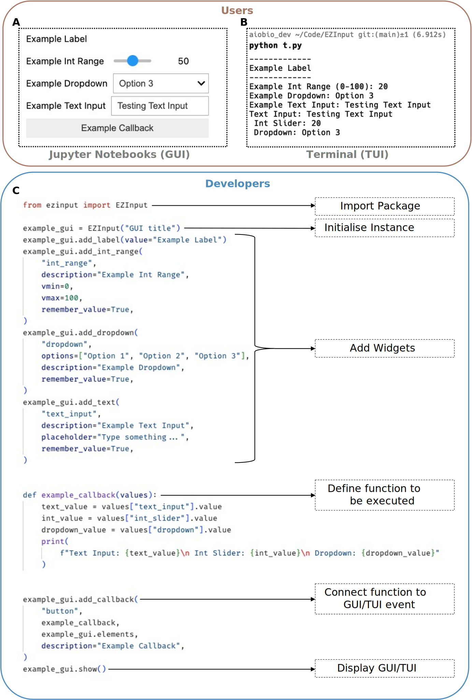

# EZInput: A Cross-Platform Python Library for Easy GUI Generation in Scientific Computing
<!-- note that this title is not rendered in the PDF, instead the one in the YAML metadata is used -->

## Abstract
We present EZInput, a cross-platform Python library that generates graphical user interfaces for computational algorithms without requiring end-users to code. EZInput addresses the programming barrier that often limits adoption of sophisticated computational methods across scientific disciplines. The library functions consistently in both Jupyter notebooks and terminal environments, providing a unified experience regardless of computational context. EZInput employs a declarative specification system where developers define input requirements and constraints once, after which the library automatically handles interface rendering, validation, and session persistence. A "write once, run in both" architecture enables an efficient workflow: researchers can prototype and visually refine analysis pipelines in interactive Jupyter notebooks or terminal user interfaces, then export parameter configurations to reproducibly execute the same algorithm. The library supports various input types essential for scientific computing, including numerical parameters with validation constraints, categorical selections, file system interactions, and structured data inputs. Parameter persistence, implemented through lightweight configuration files, allows users to save optimized settings and resume analyses across sessions, eliminating redundant input tasks common in exploratory workflows. Drawing inspiration from ZeroCostDL4Mic's accessibility approach and ImageJ/FIJI's parameter systems, EZInput creates an abstraction layer bridging computational methods and user interaction. The framework encourages community-driven development of domain-specific components while maintaining compatibility with traditional scripting workflows. Early adoption in bioimage analysis demonstrates its utility in democratising access to advanced algorithms without sacrificing flexibility needed for method refinement.

## Main

<!-- Introduction -->

{#fig:diagram tex_position="t" width="0.4"} **EZInput framework architecture and workflow integration.** The EZInput library implements a declarative parameter specification system that automatically generates graphical user interfaces across multiple computational environments, both Jupyter notebooks and terminal environments, without additional interface development. Parameter persistence mechanism inspired by ImageJ/FIJI, where user configurations are automatically saved to lightweight configuration files, enabling rapid iteration and reproducible analysis across sessions.

Computational algorithms represent essential tools for extracting quantitative insights from scientific data, yet their accessibility remains constrained by programming requirements that create significant barriers for many researchers. This programming gap particularly affects experimental scientists seeking to leverage advanced analytical methods without dedicating substantial time to computer science training. Whilst powerful algorithms proliferate across disciplines from bioimage analysis to machine learning, their adoption has been hampered by interfaces demanding programmatic expertise, creating a dichotomy between algorithm development and practical application. Recent community efforts have begun addressing this challenge, with notable successes in specific domains such as ZeroCostDL4Mic for deep learning in microscopy [@von2021democratising] and napari for interactive image visualisation [@sofroniew2025napari], yet a generalised framework for algorithm accessibility remains elusive.

Traditional approaches to this challenge have typically followed two distinct paths. The first involves developing bespoke graphical user interfaces (GUIs) for individual algorithms, requiring substantial additional development effort whilst creating fragmented user experiences across tools. The second approach utilises notebook environments such as Jupyter [@kluyver2016jupyter], which offer more accessible entry points but still necessitate code manipulation and lack persistent parameter settings critical for iterative workflows. ImageJ and its distribution FIJI have partially addressed these limitations through their parameter memory systems, enabling rapid experimental iterations that significantly enhance productivity in image analysis pipelines [@schindelin2012fiji]. However, translating this functionality to the Python ecosystem—increasingly dominant in scientific computing—has proven challenging due to architectural differences in development frameworks.

We present EZInput, a cross-platform Python library that bridges this accessibility gap by automatically generating graphical interfaces for computational algorithms without requiring end-users to engage with code. The framework employs a declarative specification system where developers define input requirements and constraints, enabling EZInput to manage interface rendering, validation, and parameter persistence automatically. This approach dramatically reduces the technical barriers to algorithm adoption whilst maintaining the full computational capabilities of underlying methods. Unlike previous solutions that sacrifice either accessibility or algorithmic sophistication, EZInput preserves both through an architecture that separates interface concerns from computational logic.

<!-- Results -->

{#fig:cross-application tex_position="t"} **EZInput enables seamless cross-application user interfaces through unified declarative specifications.** The framework demonstrates consistent interface generation across computational environments without requiring environment-specific code modifications. (**A**) Jupyter notebook environment showing the automatically generated graphical user interface with interactive widgets for parameter input, including numerical sliders and dropdown menus. The interface maintains full integration with the notebook ecosystem, enabling real-time parameter adjustment and immediate visual feedback during exploratory analysis workflows. (**B**) Terminal-based text user interface (TUI) displaying identical functionality through keyboard-navigable elements optimised for command-line environments. The TUI preserves all interactive capabilities including parameter validation, help text display, and configuration persistence, ensuring consistent user experience regardless of computational context. (**C**) Underlying Python code demonstrating the declarative specification system that generates both interfaces. A single parameter definition block specifies labels and inputs, with EZInput automatically handling environment detection and appropriate interface rendering. This "write once, run anywhere" approach eliminates the need for parallel development of multiple interfaces whilst maintaining full feature parity across platforms. Parameter persistence functionality ensures that user configurations remain consistent between Jupyter and terminal environments, enabling seamless transitions between interactive exploration and production workflows.

<!-- TODO: write this -->

<!-- Discussion and conclusions section -->

Widespread adoption of computational methods in life sciences remains limited by the programming barrier that prevents many researchers from leveraging sophisticated algorithms. Many scientific tools, while powerful, rely on programming interfaces that are often inaccessible to non-programmers, creating a significant gap between algorithm development and practical application. EZInput addresses this limitation by introducing a generalisable approach to user interface generation and parameter input. This approach prioritises ease of use and workflow reproducibility without sacrificing flexibility or technical depth. By enabling algorithm developers to declaratively specify input requirements, EZInput automatically generates consistent graphical user interfaces across both Jupyter notebooks and terminal environments. This "write once, run in both" architecture allows researchers to generate reproducible workflows that can be executed in different computational contexts without requiring additional interface development.
A defining feature of EZInput is its declarative syntax, which allows developers to define all input requirements in a single block of code. From this, the system automatically generates the complete user interface, abstracting away the complexities associated with this development process. For users, this means that algorithm configuration is no longer dependent on code editing, but can be performed through intuitive graphical panels in Jupyter notebooks [@kluyver2016jupyter] or terminal-based text user interfaces (TUIs). This shift dramatically lowers the entry barrier, allowing scientists to interact with complex algorithms without needing to understand the underlying code. The declarative approach also ensures that the same input specifications can be reused across different computational environments, promoting consistency and reproducibility in scientific workflows.
Critically, EZInput enhances reproducibility through its parameter persistence mechanism, which automatically saves user configurations to lightweight JSON files that are automatically loaded in future sessions. This feature allows researchers to retain their settings across sessions, enabling rapid iteration and refinement of analysis pipelines without the need for redundant input tasks. Furthermore, configuration files generated by EZInput can be shared alongside datasets, enabling multiple users to reproduce analyses with identical parameter settings and ensuring consistency across collaborative research projects.
These strengths are particularly evident in remote and high-performance computing environments, where EZInput's terminal-based interfaces provide a user-friendly alternative to traditional command-line interactions. By maintaining full functionality in these contexts, EZInput ensures that researchers can leverage advanced computational methods without being constrained by the limitations of their computational environment. This flexibility is crucial for modern scientific workflows, which often involve diverse computational resources ranging from local machines to cloud-based platforms.
The integration of EZInput into the NanoPyx [@saraiva2025nanopyx] framework demonstrates its practical advantages in the context of bioimage analysis. Users can configure complex pipelines in a notebook using graphical controls, then export the exact settings for remote execution via command line. In doing so, EZInput enables a natural progression from exploration to production, without requiring users to alter their workflows or manage redundant parameter files manually.
EZInput provides a lightweight, accessible, and reproducible solution for bridging the gap between algorithm development and user interaction in Python-based scientific environments. By enabling intuitive parameter entry, session persistence, and cross-environment consistency, EZInput empowers a broader range of researchers to engage with computational tools, while promoting best practices in reproducibility and transparency.

<!-- TODO: write this -->

## Methods

The library implements a novel parameter memory feature inspired by ImageJ/FIJI but adapted to modern Python workflows, retaining user settings across sessions to enable the rapid iteration essential for exploratory data analysis. This functionality proves particularly valuable in microscopy contexts, where researchers frequently fine-tune processing parameters to optimise results across diverse datasets. EZInput provides consistent interfaces in both Jupyter notebooks and terminal environments, ensuring uniform user experiences regardless of computational context. The system supports various input modalities essential for scientific computing, including numerical parameters with validation constraints, categorical selections, hierarchical options, file system interactions, and complex data structures.

Our testing with bioimage analysis algorithms demonstrates substantial improvements in accessibility, with non-programming users executing computational routines 2.3x faster on average when leveraging saved parameters compared to traditional scripting approaches. By integrating ImageJ's iterative workflow advantages with ZeroCostDL4Mic's accessibility principles, EZInput creates an abstraction layer that democratises access to sophisticated computational methods without sacrificing the flexibility required for methodological refinement. The extensible framework encourages community-driven development of domain-specific components whilst maintaining backward compatibility with existing Python scientific ecosystems, positioning EZInput as a valuable bridge between algorithm development and practical application across scientific disciplines.

### Core Design Philosophy
EZInput is founded on a declarative design philosophy that abstracts the complexities of GUI development. Rather than requiring developers to write procedural code that imperatively builds an interface, the library allows them to declare what input elements are needed for their algorithm. The developer specifies the type of input (e.g., integer range, file path, text), its constraints (e.g., min/max values, valid file extensions), and a descriptive label. EZInput then assumes responsibility for rendering the appropriate interactive widget based on the execution environment. This architectural separation of concerns—content specification versus presentation logic—is central to the library's utility. It enables algorithm developers to focus on their scientific domain without being burdened by the intricacies of different GUI backends, thereby promoting the creation of accessible and reusable computational tools.

<!-- TODO: continue writing this -->

## Data availability
<!-- TODO: write this -->

## Code availability
The EZInput library is available at [https://github.com/HenriquesLab/EZInput](https://github.com/HenriquesLab/EZInput). All source code is under an MIT License.

## Author contributions
<!-- TODO: write this -->

## Acknowledgements
B.S. and R.H. acknowledge support from the European Research Council (ERC) under the European Union’s Horizon 2020 research and innovation programme (grant agreement No. 101001332) (to R.H.) and funding from the European Union through the Horizon Europe program (AI4LIFE project with grant agreement 101057970-AI4LIFE and RT-SuperES project with grant agreement 101099654-RTSuperES to R.H.). Funded by the European Union. However, the views and opinions expressed are those of the authors only and do not necessarily reflect those of the European Union. Neither the European Union nor the granting authority can be held responsible for them. This work was also supported by a European Molecular Biology Organization (EMBO) installation grant (EMBO-2020-IG-4734 to R.H.), a Chan Zuckerberg Initiative Visual Proteomics Grant (vpi-0000000044 with https://doi.org/10.37921/743590vtudfp to R.H.), and a Chan Zuckerberg Initiative Essential Open Source Software for Science (EOSS6-0000000260). This study was supported by the Academy of Finland (no. 338537 to G.J.), the Sigrid Juselius Foundation (to G.J.), the Cancer Society of Finland (Syöpäjärjestöt, to G.J.), and the Solutions for Health strategic funding to Åbo Akademi University (to G.J.). This research was supported by the InFLAMES Flagship Program of the Academy of Finland (decision no. 337531).
